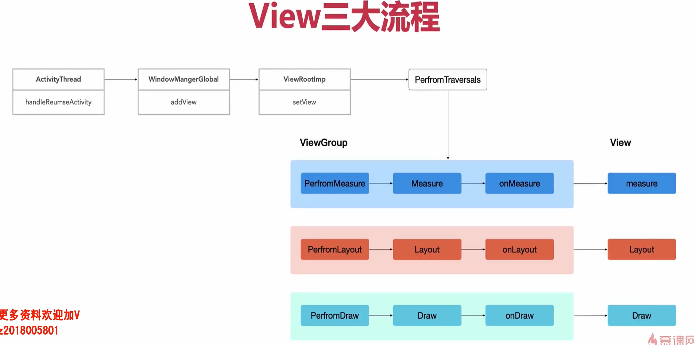

1. Launcher启动流程与ActivityThread分析


- ZygoteInit工作内容：
``` java
public static void main(String argv[]) {
    //预加载frameworks/base/preloaded-classes和framework_res.apk资源,这些系统资源加载可以避免在启动app时加载缓慢
    preloadClasses();
    preloadResouces();
    preloadSharedLibraries();

    //启动system_server进程，该进程是framework的核心进程
    if (argv[1].equals("start-system-server")) {
        startSystemServer();
    }

    //创建socket服务
    registerZygoteSocket();

    //进入阻塞状态，等待连接，用以处理来自AMS申请进程创建的请求
    runSelectLoopMode();

    //Zygote进程创建完成
}
```
- SystemServer工作内容：
``` java
public static void main(String argv[]) {
    //创建系统的服务的管理者
    SystemServiceManager mSystemServiceManager = new SystemServiceManager(mSystemContext);
    //启动引导服务
    startBootstrapServices();
    //启动核心服务
    startCoreServices();
    //启动其它一般服务
    startOtherServices();
}
```

2. Launcher的启动流程

- 涉及到的不同类的作用：
    - ActivityManagerService: activity生命周期调度的服务类
    - ActivityTaskManagerService: 是将ActivityManagerService中对activity管理的功能转移到该类中处理，专门负责activity相关的工作
    - RootActivityContainer: 调用了packageservice查询系统中已安装的所有应用哪一个是复符合launcher标准并创建一个Intent对象，然后将Intent对象交由ActivityStarter对象处理
    - ActivityStarter: 启动Launcher前的各种检查如权限、是否可见等，然后启动Launcher。
    - ActivityRecord: 是在server端对antivity的的映射，因为在server端是无法拿到activity的实例的，所以使用activityrecord记录存储了activity的所有信息。
    - TaskRecord: 就是任务栈，记录的一个或多个activityrecord的实例。
    - ActivityStack: 它不是任务栈！它是任务栈的管理者，应用运行时会有一个或多个TaskRecord，这些任务栈就交给activityStack管理。
    - ActivityStackSupervisor: 手机运行中会启动一个或多个应用，当启动多个应用时就会有多个ActivityStack，这时候就需要它来对ActivityStack进行管理。
    - ProcessList: Android10中引入，将原ActivityServiceManager中启动进程的工作交由该类完成
    - ZygoteProcess: 由它来和Zygote进程建立起socket连接把创建进程需要的参数发送过去。

- 任务栈结构：


- Launcher启动的流程图:


- 文件对应关系：


- 设置应用为Launcher应用：
``` java
    <category android:name="android.intent.category.HOME"/>
    <category android:name="android.intent.category.DEFAULT"/>
```

- ActivityThread结构:


- Activity的核心知识点:

    - 从Activity生命周期过程探索view的绘制过程：
    ``` java
    attach() ->
    onCreate() -> 
    setContentView() ->
    onResume()-> view的加载和渲染是在onResume之后进行的
    ``` 

    - ViewRootImpl作用:
    ``` java

    ```

    - View绘制的三大流程:
    


    - 手势分发流程:
    

- FragmentTransaction提交方式：
    - commit():如果在宿主执行了onSaveInstanceState之后再执行该操作会抛出异常，属于异步事物。
    - commitAllowingStateLoss():如果宿主执行了OnSaveInstanceState之后再执行该操作，不会去检查宿主的状态，不会抛出异常。但该操作不会被Activity记录，恢复时也没有办法恢复这些提交的操作，所以该操作适用不重要的事务。属于异步事物。
    - commitNow():会立刻执行当前提交的transaction事务，属于同步事务。
    - commitNowAllowingStateLoss():具备以上两者的特性，即是同步执行，也不会检查宿主的状态，有可能该操作不会被正确恢复。

- Fragment发生重叠的原因：重复添加。在添加fragment时需判断当前fragment是否已添加到activity中，这里添加fragment时需要指定一个tag以方便查询。

- Fragment懒加载（新版）: ViewPager2

- RecyclerView:


- RecyclerView-Recycler回收池：
``` java
//4级缓存
public final class {
    //#1 这一级缓存在复用时不需要重新bindViewHolder，
    ArrayList<ViewHolder> mAttachedScrap;  //没有发生变化的item
    ArrayList<ViewHolder> mChangedScrap;    //发生了变化的item

    //#2 这一级缓存可通过setItemCacheSize调整，默认大小为2（被划出屏幕的item会缓存在这里，当再次被滑进屏幕是也不需要重新绑定数据）
    ArrayList<ViewHolder> mCachedViews;

    //#3 自定义扩展View缓存(缓存能力的扩展，允许开发者自定义缓存位置和实现方式)
    ViewCacheExtension mViewCacheExtension;

    //#4 当mCachedViews缓存无法满足缓存需求（放不下）时会启用这一级缓存，会根据ViewType存取ViewHolder
    //可通过setRecycledViewPool调整，每个类型容量为5
    RecycledViewPool mRecyclerPool;

    //从第二级缓存到第四级缓存是一个扩展存储的过程，第二级中存储的是刚移除屏幕的2个item，其它存不下的item会逐个缓存到第四级缓存中。
}
```


- RecyclerView使用总结:
    - 插拔式设计模式，增加组建的灵活性
    - 尽量指定RecyclerView和item的宽高
    - 尽量使用定向刷新notifyItemChanged


- 多线程实现方式：
    1. 创建Thread
    2. AsyncTask
    3. HandlerThread (需要手动停止退出)
    4. 线程池

- synchronized锁
    1. synchronized加在方法上表示对该方法锁在对象加锁，为获取到这个对象的所有线程会阻塞
    2. synchronized加在代码块上，区分是对class加锁还是对对象加锁。代码块以外的代码可以同步访问
    3. synchronized加在static方法上，是对class对象加锁，所有访问该方法的线程都会阻塞

- synchronized的优势和劣势
    1. 如果一个同步方法出现了异常，jvm也能够自动释放锁。能够规避死锁不需要用户手动释放。  `优势`
    2. 必须等到获取锁对象的线程执行完或者出现异常，才能释放锁。不能中途释放，不能中断一个正在试图获得锁的线程。    `劣势`
    3. 多个线程竞争获取锁时，无法获知获取锁成功与否。   `劣势`
    4. 每个锁只有单一的条件不能设置超时。      `劣势`

- ReentrantLock 悲观锁、可重入锁、公平锁、非公平锁
    1. 可以通过构造参数指定为公平锁或者是非公平锁
    2. 可以通过使用Condition来指定哪个线程获取锁，这个功能弥补了内部锁无法指定哪个线程获取锁的需求。

- ReentrantReadWriteLock 共享锁，排他锁
    1. 共享锁，所有线程均可同时获取，并发量高，比如在线文档查看。
    2. 排他锁，同一时刻只能有一个线程有权修改资源，比如在线编辑文档。
    3. ReentrantReadWriteLock中内置了两个锁，ReadLock 和 WriteLock

- 线程池实现原理：
根据线程池创建的几个参数来解释
- 线程池复用原理：
    1. 根据线程池创建的几个参数来解释，
    2. 非核心线程会通过workqueue的poll方法来阻塞自己，阻塞的时间是设置的线程存活时间，超过阻塞时间会脂肪线程；核心线程会通过workqueue的take方法一直阻塞，知道获取一个可执行的任务位置
    ``` java
    ....
    Runnable r = timed ? workQueue.poll(keepAliveTime,TimeUnit.NANOSECONDS):workQueue.take();
    if (r!=null)
        return r;
    ....
    ```

- kotlin协程
    
   
